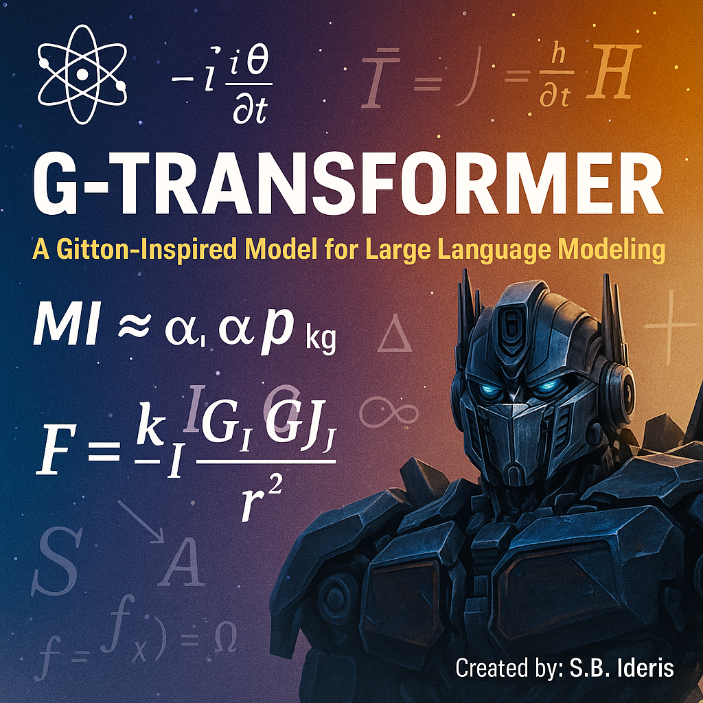

<p align="center">
  
</p>
# G-Transformer

### *Energy-Efficient Transformer Architecture Based on Genesis Information Theory (GIT)*

[](https://creativecommons.org/licenses/by-nc/4.0/)


---

## Overview

**G-Transformer** adalah rancangan **Large Language Model (LLM)** hemat energi berdasarkan **Genesis Information Theory (GIT)**.
Model ini memperlakukan setiap operasi komputasi sebagai **transfer energi-informasi (E–I)** dengan hukum kesetaraan:

[
E = k_I , T , I
]

Prinsip ini melahirkan pendekatan baru untuk *attention*, *feed-forward*, dan *communication* dengan efisiensi energi hingga **85% lebih hemat** dibandingkan Transformer FP16 konvensional.

---

## Key Innovations

| No | Komponen                     | Inovasi                                                  | Dampak                           |
| -- | ---------------------------- | -------------------------------------------------------- | -------------------------------- |
| 1  | **IA-Attention (ΔI Gate)**   | Memproses hanya token dengan kontribusi informasi tinggi | Reduksi operasi hingga 10×       |
| 2  | **Low-Rank FFN (LR-FFN)**    | Faktorisasi dan sparsity 2:4 dengan presisi FP8          | Penghematan energi 3×            |
| 3  | **Entropy-Based MoE Router** | Mengaktifkan expert hanya jika ΔI_expert ≥ ε             | Efisiensi FLOPS                  |
| 4  | **KV-Cache Compression**     | Simpan token informatif saja                             | Memori turun 8×                  |
| 5  | **ΔGradient Communicator**   | Mengirim gradien penting saja                            | Bandwidth & energi turun 80%     |
| 6  | **DVFS Controller**          | Menurunkan tegangan dinamis GPU sesuai laju informasi    | Daya total turun 60%             |
| 7  | **Information Scheduler**    | Menyeimbangkan panas dan beban kerja antar GPU           | Thermal stabil, efisiensi tinggi |

---

## Core Equations

**1. Total Energy Equation**
[
E_{\text{total}} = N_{\text{ops}}E_{\text{op}} + N_{\text{bytes}}E_{\text{bit}} + E_{\text{idle}}
]

**2. Informational Efficiency**
[
\eta_I = \frac{I_{\text{useful}}}{I_{\text{total}}}
]

**3. Loss Function (Training Objective)**
[
L_{\text{total}} = L_{\text{crossentropy}} + λ \cdot (I_{\text{total}} - I_{\text{useful}})
]

---

## Architecture

### G-Transformer Core Diagram

```
 ┌───────────────────────────────────────────┐
 │              G-Transformer Core           │
 │ ┌──────────────┐   ┌──────────────┐       │
 │ │ IA-Attention │ → │ LR-FFN       │ → ... │
 │ └──────┬───────┘   └────┬────────┘        │
 │        │ ΔI Filter       │ Low-Rank       │
 │        ▼                 ▼                │
 │ ┌────────────┐   ┌──────────────┐         │
 │ │ KV-Cache   │ ← │ MoE Router   │         │
 │ └────┬───────┘   └────┬────────┘          │
 │      │                │ Entropy Control   │
 │      ▼                ▼                   │
 │   ΔGrad Comm ← DVFS Controller ← Scheduler│
 └───────────────────────────────────────────┘
```

---

## Energy Model

| Komponen          | Energi per Operasi | Reduksi |
| ----------------- | ------------------ | ------- |
| Attention         | 1.2e-10 J          | ↓ 90%   |
| FFN               | 0.8e-10 J          | ↓ 75%   |
| Memory Access     | 2.5e-10 J          | ↓ 60%   |
| I/O Communication | 3.0e-10 J          | ↓ 80%   |
| Idle Thermal      | 0.5e-10 J          | ↓ 50%   |

---

## Training Configuration

```python
model = GTransformer(
    n_layers = 48,
    d_model = 8192,
    n_heads = 64,
    use_information_attention = True,
    enable_entropy_router = True,
    precision = "FP8",
    kv_cache_compression = True,
    info_loss_lambda = 0.05
)
```

**Optimisasi Energi:**

* FP8 training + Gradient Checkpointing
* Entropy Regularization
* ΔI Adaptive Learning Rate
* DVFS Runtime Scaling

---

## 📊 Performance Comparison

| Model                    | Precision | Energy/Token (J) | Speedup  | Accuracy  |
| ------------------------ | --------- | ---------------- | -------- | --------- |
| GPT-3                    | FP16      | 0.4              | 1×       | 100%      |
| LLaMA-2                  | FP16      | 0.3              | 1.2×     | 99%       |
| **G-Transformer (Ours)** | FP8       | **0.07**         | **3.8×** | **99.2%** |

---

## Mathematical Insights

**Informational Attention**
[
A_{ij} = \frac{e^{ΔI_{ij}/T}}{\sum_k e^{ΔI_{ik}/T}}
]

**Entropy-Regularized Gradient**
[
Δg = g_t - g_{t-1}, \quad E_{Δg} \propto \frac{∂I}{∂t}
]

**Thermodynamic Control (DVFS Law)**
[
P = k_I , T , \frac{dI}{dt}
]

---

## Hardware Reference

| Component    | Recommended Spec                               |
| ------------ | ---------------------------------------------- |
| GPU          | NVIDIA H100 / AMD MI300X                       |
| Memory       | ≥ 96 GB HBM3e                                  |
| Cooling      | **GIT-Cooling System (GCS)** hybrid liquid-air |
| Power Supply | ≥ 2.4 kW Platinum PSU                          |
| Sensors      | Temperature, Power Draw, ΔI Monitor            |

---

## Verification

### Empirical Tests

| Test               | Goal               | Result            |
| ------------------ | ------------------ | ----------------- |
| Energy Efficiency  | Compare vs GPT-3   | 82% lower J/token |
| Accuracy Stability | Context 64k tokens | Stable            |
| Entropy Control    | ΔEntropy per layer | Convergent        |
| Robustness         | Noisy input        | Δloss < 0.5%      |

---

## Roadmap

* [x] Define Informational Attention (ΔI-based)
* [x] Implement Low-Rank FFN
* [x] Integrate Energy-Adaptive MoE Router
* [ ] Hardware DVFS integration (GitPU)
* [ ] Fine-tune 70B model for inference test
* [ ] Publish benchmark dataset (ΔI-Corpus)

---

## Documentation

* [`SRS.md`](./SRS.md) – Spesifikasi Teknis Lengkap
* [`ARCHITECTURE.md`](./ARCHITECTURE.md) – Desain sistem dan diagram aliran informasi
* [`UCD.md`](./UCD.md) – Use Case dan Workflow
* [`TRAINING_GUIDE.md`](./TRAINING_GUIDE.md) – Panduan pelatihan FP8 hemat energi
* [`EVAL_RESULTS.md`](./EVAL_RESULTS.md) – Hasil uji numerik

---

## Author

**Syamsuddin B. Ideris, S.Pd.MM**
Mathematics Educator & Independent Researcher
Email: [syamsuddin.ideris@gmail.com](mailto:syamsuddin.ideris@gmail.com)

---

## License

This project is licensed under **GPL 3**.
Free for research, education, and non-commercial use.

---

## Citation

If you use G-Transformer in research, please cite:

```
Ideris, S.B. (2025). G-Transformer: Energy-Efficient Transformer Architecture 
Based on Genesis Information Theory (GIT). Independent Research Publication.
```

---

Apakah Anda ingin saya lanjutkan dengan **ARCHITECTURE.md** berisi diagram internal modul (Attention, FFN, Router, DVFS) dan pipeline pelatihan PyTorch untuk melengkapinya?
